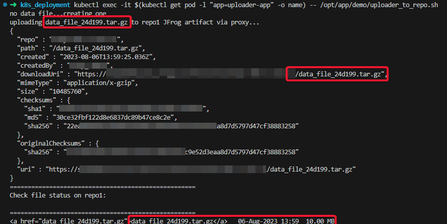
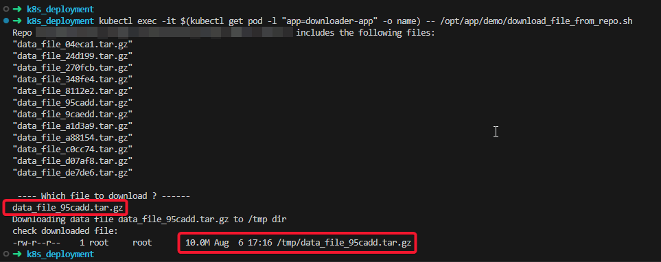

# JFrog Federation PoC - High Availability Repository

The aim of this Proof of Concept (POC) is to demonstrate Federated repositories as part of JFrog Artifactory solution.

In the PoC following concepts will be covered:

:frog: Setup Active-Active repository of JFrog Artifactory cloud with a single URL.  
:frog: Upload a binary file to federated repository and confirm file distribution to all repositories.  
:frog: Download a binary file from Artifactory through a single URL.   

A single URL access is implemented by using a reverse proxy (Nginx) to proxy more than one instance
of Artifactory.

**Table of Contents**

- [JFrog Federation PoC - High Availability Repository](#jfrog-federation-poc---high-availability-repository)
  - [Why do I need a Federated Repositories?](#why-do-i-need-a-federated-repositories)
  - [Federated Topology](#federated-topology)
  - [Target Audience](#target-audience)
  - [Assumptions](#assumptions)
  - [PoC execution plan](#poc-execution-plan)
  - [PoC installation](#poc-installation)
    - [Creating two JFrog cloud trial instances](#creating-two-jfrog-cloud-trial-instances)
    - [Deploy K8S environment](#deploy-k8s-environment)
    - [Upload and Download from Federated repository](#upload-and-download-from-federated-repository)
  - [Summary](#Summary)


## Why do I need a Federated Repositories?

Federated repositories allows mirroring of artifacts and their metadata with other repositories of a Federated type located on remote JFrog Platform Deployments (JPDs) in a multi sites environment. The Federated repository functions similarly to a local repository on the JPD but is grouped together logically with other Federated members located on other JPDs, to create a Federation.

A Federation is a collection of repositories of Federated type in different JPDs that are automatically configured for full bi-directional mirroring. 
Once you have created a Federation, changes made to artifacts on one member of the Federation will be replicated asynchronously to the other federated members. 
The Federated repository configuration is also aligned across all members in the Federation.

Federated repositories provide Enterprise organizations running software in more than one geographical site with a single source of truth for the binaries, as if they were one seamless unit, and support the following use cases:

:frog: Distributed Development teams

:frog: Remote Production environment

:frog: Increase artifacts availability in a multi-site environment

Available JFrog subscription levels:

**Self-Hosted/ Cloud**

  > ENTERPRISE

  > ENTERPRISE+

:bell: ***Note:***  For a free trial account, it is possible to create federation repository but synchronization is disabled.

## Federated Topology
Federated repositories are easy to set up and support bi-directional synchronization of local repositories without the need to set up complex topologies. 
These types of repositories are based on bidirectional replication, whereby artifact metadata is replicated constantly separately from the binary content.

As displayed below, setting up mirroring across two sites using Federated repositories inherently support mirroring removing the need to create the mesh topology.


## Target Audience
Individuals involved in IT development, IT operations, or IT service management. Individuals whose role are touched by DevOps and Continuous Delivery, such as the following IT roles: DevOps engineers. Product owners.

Good understanding of:

:frog: JFrog Artifactory
:frog: Networking
:frog: Kubernetes

## Assumptions 
Before starting the PoC the following assumptions are considered:

1) The user have a basic understanding of kubernetes (k8s) environment and deployment.
2) The user is capable to manage k8s cluster (create namespace, apply deployments, etc').
3) The k8s cluster can reach the internet and be able to pull the basic Alpine Linux and Nginx images. 
4) Same Username and Password for both repositories will be created and available. 

## PoC execution plan

Summary of the activities covered in this PoC:

1. Deploy **two JFrog cloud trial instances** (use https://jfrog.com/start-free/ )  
 
   a) demotest1.jfrog.io  
   b) demotest2.jfrog.io  

   (Alternative option is to use existing enterprise accounts)
3. Create the same repository in both instances.
4. Create the same user in both instances.
5. Setup repository federation between the two instances.
6. On a local or remote kubernetes cluster Deploy a reverse proxy configure it to proxy the two Artifactory instances.
7. Deploy an **uploader pod** that will:  

   * Generates a random binary file and uploads it to Artifactory through a single URL. 
     (a single URL that will balance between the two Artifactory cloud instances)  
   * After uploading the file, a test that will check for the file's existence in both cloud instances.  
8. Deploy a **Downloader pod** that will get a binary from Artifactory through a single URL.

## PoC installation

Follow the actions below to prepare the PoC setup.

### Creating two JFrog cloud trial instances

This section covers the actions required to create Artifactory instances and federation repositories.

1. Follow the instructions in the link below to register to JFrog Artifactory.
   [Get Started](https://jfrog.com/help/r/get-started-with-the-jfrog-platform/get-started)
   Two Artifactories will required 2 different email account for registration.

2. After registration, make sure to define the same username and password on both Artifactory instances.
3. Read and implement [Access Federation](https://jfrog.com/help/r/jfrog-platform-administration-documentation/access-federation) to sync the two federation repositories. Pay attention to [establish the circle of trust](https://jfrog.com/help/r/jfrog-platform-administration-documentation/access-federation?section=UUID-0466dded-8b0a-fbb1-852d-1b2a65e95479_id_AccessFederation-EstablishingtheCircleofTrust) that allow mirroring of the two repositories.

  :bell: **Note** Repository sync and mirroring is not applicable on trail account.

  At the end of this stage you should have the following information available:  

  :frog: Username and Password  
  :frog: JFrog cloud instances URL (e.g demotest1.jfrog.io and demotest2.jfrog.io)  
  :frog: Federation repository URL (e.g demotest1.jfrog.io/artifactory/demo-1-west-1 and demotest2.jfrog.io/artifactory/demo-2-east-1)  

### Deploy K8S environment

1) clone the repository to the k8s cluster environment.
   ```bash
   git clone https://github.com/shayrm/Frog_Federation.git
   ```
2) cd to the repo directory and into the k8s deployment scripts 
   ```bash
   cd <fgrog-demo>/k8s_deployment
   ```
3) Modify the following files and enter the relevant information
   
   edit `secret.yaml` file and replace `Username` and `Password` with the encoded values.

   ```yaml
   apiVersion: v1
   kind: Secret
   metadata:
    name: demo-secret
    namespace: jfrog-integration
   type: Opaque
     data:
      username: <username>
      password: <password>
   
   ```

   to generate encode username and password you can run the following commands:

   ```bash
   echo -n "<username>" |base64
   echo -n "<password>" |base64
   ```

   Copy the outputs values to the `secret.yaml` file  

4) Modify `configmap.yaml` file and update the following environment variables:  
   
   ```yaml
   apiVersion: v1
   kind: ConfigMap
   metadata:
     name: env-config
     namespace: jfrog-integration
   data:
     INSTANCE_1: "shaydemotest1.jfrog.io"
     INSTANCE_2: "shaydemotest2.jfrog.io"
     REPO_1: "artifactory/shay-demo-1-west-1"
     REPO_2: "artifactory/shay-demo-2-east-1"
   ```
5) Deploy the k8s configuration in the following order:
   ```bash
   kubectl apply -f namespace.yaml
   kubectl apply -f secret.yaml
   kubectl apply -f configmap.yaml
   kubectl apply -f deploy-uploader.yaml,deploy-downloader.yaml,deploy-nginx-proxy.yaml,nginx-service.yaml 
   ```
6) Use the `switch_context.sh` script to set `jfrog-integration` as the working namesapce
   ```bash
   ./switch_context.sh
   Context "default" modified.
   ```

7) Check that all pods are in `running` states and there are no errors.
   ```bash
   kubectl get pods

   NAME                                   READY   STATUS    RESTARTS   AGE
   uploader-app-8dd9d5957-2l6rw           1/1     Running   0          16s
   downloader-app-755b8cc88b-xhbk5        1/1     Running   0          14s
   nginx-reverse-proxy-775996867f-zdx52   1/1     Running   0          14s
   ```

   Check that Nginx service is available as well

   ```bash
   kubectl get service
   
   NAME            TYPE        CLUSTER-IP      EXTERNAL-IP   PORT(S)   AGE
   nginx-service   ClusterIP   10.43.142.123   <none>        80/TCP    16s
   ```

   At this point the setup is ready to continue and test the federation repository.

### Upload and Download from Federated repository 
The k8s deployment includes to pods:  
:frog: uploader-app  
:frog: downloader-app  

In each there are built-in scripts that use the Nginx pod as a revere proxy to loadbalance the request to the two repositories.  
In that way the user could test the Active-Active setup. Uploading the file to any of the repository will mirror the file to the other one.

1) Upload a random generated binary file to the federated repository.
   The uploader scrip will generate a binary file with random extension and upload it to the repository.  
   Run the following command from the k8s host:  

   ```bash
   kubectl exec -it $(kubectl get pod -l "app=uploader-app" -o name) -- /opt/app/demo/uploader_to_repo.sh
   ```  

   The correct output should indicate that the file is present in the repositories

   


2) Check it is possible to download file from federated repository.
   Use the following command to download binary file to the `downloader-app` pod

   ```bash 
   kubectl exec -it $(kubectl get pod -l "app=downloader-app" -o name) -- /opt/app/demo/download_file_from_repo.sh
   ```
     
   The correct output should indicate that the file was successfully downloaded and present in the `downloader-app` /tmp directory.  

   

## Summary
With this PoC we were able to demonstrate how JFrog Artifactory with federation repository setup can provide a High availability solution.
Which provide protection and reduce risk of loosing one repository. In addtion a constent backup in seperate location of the organization resource, code and artifaces.  


 
